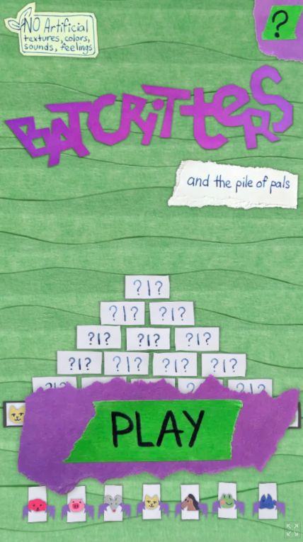

## About

[Batcritters](https://ash-k.itch.io/batcritters-and-pals) is an original domino solitaire for mobile, web and desktop. Created as a birthday gift for a solitaire lover in my life.  

Connect pals into loops and complete them with batcritters until the pile is empty! 100% hand crafted out of paper with love.  

Released August 2023  

## : Game Design
My design goals when creating Batcritters were to capture the snappy bite sized decision making and flow of classic tri-peaks solitaire while giving it more friction and rewarding long term planning. 

I wanted to make a game with a whimsical lighthearted theme as opposed to abstract rules of most solitaires. While exploring the design space of dominoes, an idea of forming loops of connections came to mind, which I wanted to style as cute animals holding hands in a circle dance. The game utilizes properties of dominoes to make sure players are never stuck due to random chance and can win.

I iteratively refined its design until the difficulty felt fair and the progression of the game was satisfying, initially with a playingcards.io prototype and later in-engine. In the early stages of the game players can formulate a strategy based on pairs which are available. As they approach the top of the pyramid the number of choices shrinks and they are left with the consequences of their prior planning. 

To keep the game challenging and enjoyable at different skill levels with the same rules I added a minor and a major win conditions. Both of them celebrate the players success, with the minor one encouraging you to go for the harder to achieve major one. The major victory condition changes the middle of the game by encouraging players to plan thoroughly and use up their choices to leave the bare minimum they can get away with for the end of the draw.
## : Game Development
Batcritters was developed from concept through design, iteration and to final release in just 4 days of fulltime work. After prototyping it on playingcards.io and playtesting it with friends I nailed down the rules and the limitations of the game to speed up implementation. 

I made the game in Godot Engine, starting with a simple prototype using emojis and geometric shapes. Eventually adding countless satisfying animations to it in places where important information and changes were easy to miss, or making progress didn't feel triumphant enough. I tried to make it clear which options were available to a player at any point at a glance as adding on-hover affordances wasn't an option for a mobile game.

As I wanted the game to feel true to the physical materials used to make it - most assets are kept close to their original scale and some have random variations to avoid perfect repetition.

## : Asset Creation
When making BatCritters I was concerned with making it feel as authentic as possible. To achieve it I created all of the assets used in the game irl out of construction paper, cards, glue, and painters tape which were later photographed and implemented with minimal digital alterations.

The sound effects for the game were made by recoding shuffling, moving and interacting with scraps of the same materials. 

To preserve the feeling and texture of resulting assets their relative scales irl match those seen in the game. 

The one defining element of working with paper collage which couldn't be captured with photographs alone were the subtle drop shadows formed by the relative thickness of  paper at these scales. They were added digitally, tying the scene together and helping foreground elements stand out from the background.
