# Creating a token rearranging puzzle to represent alchemical transformations

# The context

For our capstone project we are making a curiosity-driven sandbox puzzle game in which you attempt to figure out the rules that govern alchemy and the world to exploit them

The main thing you, as an aspiring alchemist sent on a research trip, do in this world is alchemize things (by drawing circles around them), so we wanted to make sure that this mechanic was good enough to be worthy of the spotlight at the core of the experience, fit the game thematically and served our aesthetic goals of encouraging experimentation and rewarding curiosity.

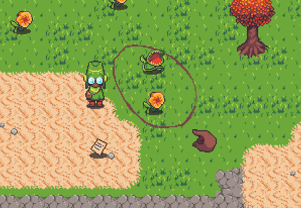  
alchemist drawing a transmutation circle around a pair of unsuspecting plants

## The essences

Everything in this world that is worth anything is made up of 3 essences in a sigil. These essences can be of various flavours (orange, apple, raspberry) and their arrangement within the sigil is what determines what an object ends up being.

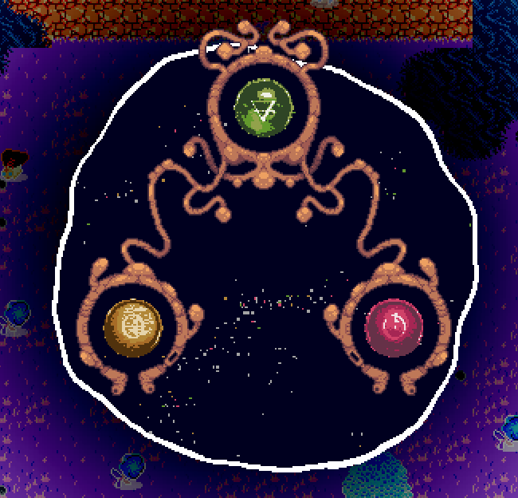  
essences of a toad within a transmutation sigil

## The constraints

Before even setting out on this journey the hole where a transmutation mechanic should be in our design had already acquired a peculiar shape. Constraints defined by other parts of our design and narrative helped narrow down my options.

We needed a system that would take a few objects, 3 essence each, as an input, let players do things to their components, and then output new objects, now changed by the player.

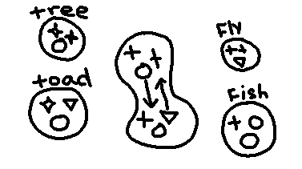  
example of a possible transmutation, essences are preserved but change owners

Alchemy is just magical &amp; superstitious proto chemistry, so many parts of our system drew inspiration from both. One of the resulting constraints was that no essences are created or removed from this world, they only move between different objects, their combinations and arrangements defining the thing being created.

Getting to a desired arrangement of essences would need to be non trivial and a skill you could improve as this was something you would do for most of the game.

And lastly, for a curiosity based game with no tutorial, it had to be learnable through poking and prodding at it alone.

# The process

A concept that was proposed at some point was thinking of essences in a sigil as vertices on a higher-dimensional polyhedron, with various moves you could do being rotations of the vertices on it. It was fun to think about and turning the gears underlying the universe sounded fun, however it was hard to think about and severely limited our options.

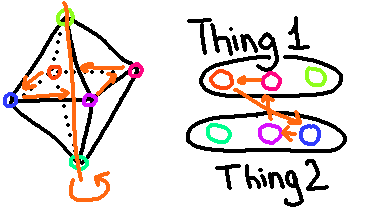  
swapping of essences(colour coded) interpreted as rotation around an axis of vertices within within an octahedron

Taking that thought a bit further we remembered rubik's cube style toys. Characterized by moving tokens in a geometric arrangement according to predefined rules to arrive at an arrangement that is desired.

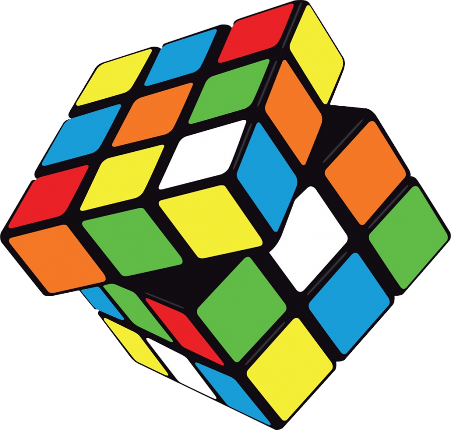  

What joy, those toys already fit many of our constraints and were thematically close to our intentions, including the one about things being preserved, the rules being discoverable through poking and prodding and being non trivial to move to the desired state.

That discovery also made another constraint immediately clear while proving a solution: After rearranging essences no empty space must remain, all of them have to end up somewhere. So if you move a piece out of one position and into another - the essence that was there before has to go somewhere and some essence needs to take the empty spot that you just left. This meant that all ways of moving an essence from one spot to another had to be cyclical, a sequence of 2 or more essences that take each other's positions after the move.

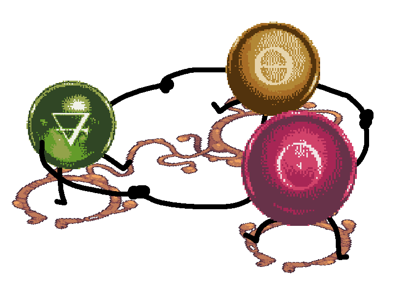  
essences always move in groups that form a closed loop

At this point I was unsure of how to proceed or what cycles could work so I took a step back and moved a few layers of abstraction away from transmutation and into the realm of dots and arrows to see what kinds of essence exchanges could be possible between two or three objects.

Seeing all those possibilities gave me something to choose from when assembling a movement pattern. I wanted the two objects to be treated equally in the movement as the player has no way of choosing which one appears in which slot (you simply draw a circle around them and yourself to cause a transmutation) and the symmetry felt thematically relevant.

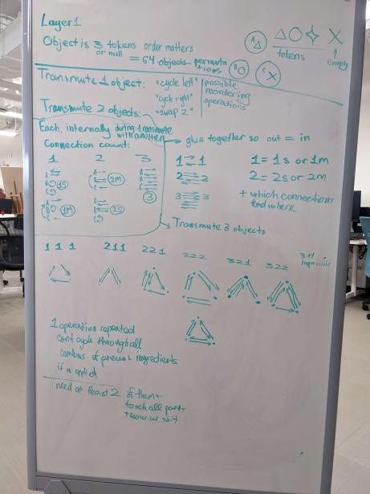  
abstract representation of all possible ways to move essences between objects

The sigils we chose were initially triangles but in the end evolved into a V shape, as it was asymmetrical and would allow us to show one of the essences(centre one) as more important than the other 2. We decided to arrange them for the transmutation by overlapping the long ends of the Vs to align the sockets into a hexagon as that was visually pleasing to look at.

I made a simple button based version to test out the transmutation mechanic prior to proof of concept week and a nicer to the touch one during it.

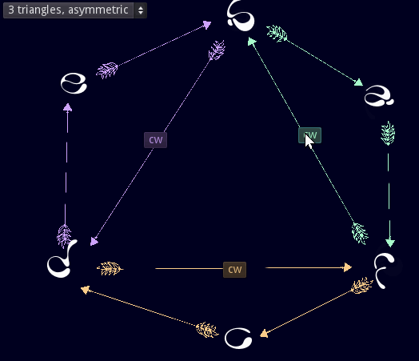  
early button based prototype of the transmutation system

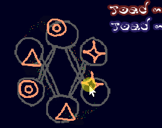  
the initial version of the motion controlled transmutation

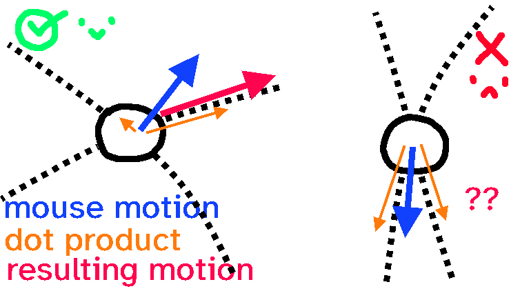  
illustration of why the game can get confused about intentions with some arrangements, note the size difference of competing orange lines in both cases

The fancier one has you pulling essences out of their sockets to drag them along a looping path as the other ones follow behind it, like a rosary. One quirk of this system however is that as you pull on the essence it has to decide along which path it will move based on the direction you've been moving it so far which is more likely to guess your intentions if the paths are perpendicular to each other, adding yet another lens to look at the problem.

With aesthetics, clarity,symmetry and movement quirks in mind the wide range of options presented by analysing what could be done quickly shrank and crystalized into 2 arrangements. Each with their own peculiar details about how things move and the consequences of that (in one of them the opposites will always remain opposite each other).

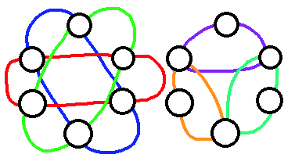  
the movement patterns we settled on

# Outcome

I really like the version we ended up with as it satisfied most of our constraints and goals we had in mind: It echoes a lot of the motifs we have in other places throughout the game, is expandable, tactile and seems to be easy to figure out based on playtests conducted so far.

My main takeaway from this experience is that taking 4 steps back and looking at the problem from a more abstract and removed angle helped me better understand the rules and dynamics of a system being created. However, to properly evaluate it and act on that understanding I had to go back in and analyze it from a more playful and human pov, trying to pay attention to the details and the assumptions that could be made based on the behaviour I could observe.
