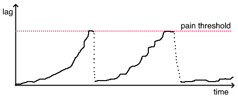
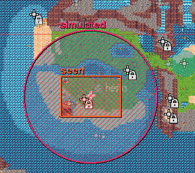
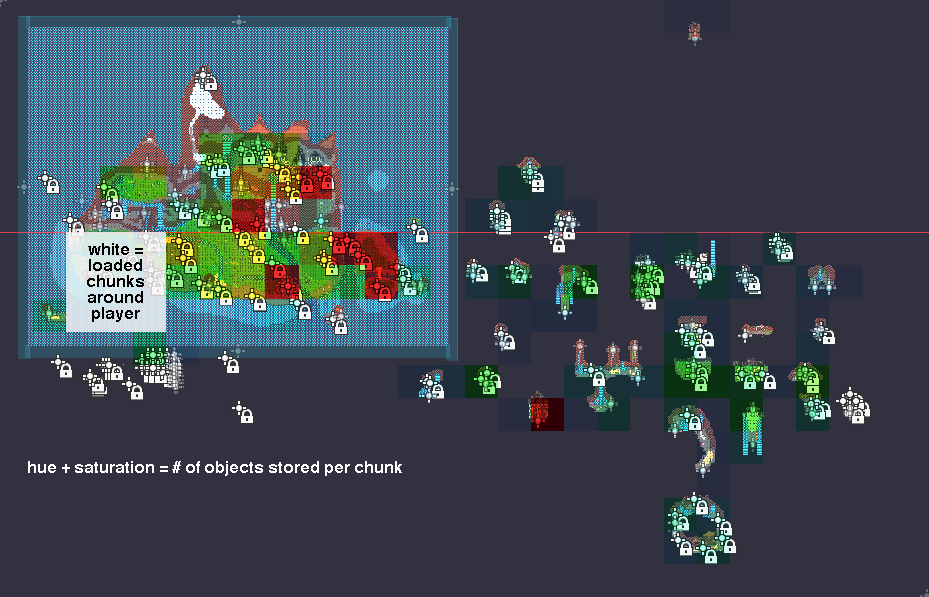

# How we optimized a systemic open world game and you can too!

### The game

We are making an open world simulation-sandbox mystery game inspired by the likes of outer wilds. In our case the mystery you solve is figuring out how the complex and intertwined systems that govern the sandbox you are in can be combined, exploited and later subverted.

### The problem
For the sandbox and its inhabitants to feel alive and the systems to be fun to figure out - they both need to be sufficiently complex. And in order to have a truly open world - the player needs to be able to explore it without crossing level boundaries or loading screens. 

Problems only occur when combining those two aspects of our game into one, as now we need to simulate numerous creatures and things, spread across a world which can not be segmented into levels or zones, and has to be ready and look alive wherever the player goes. If we use the naive approach and spawn and simulate everything in the world - the interlocking systems and ai we have lovingly built drop performance to unplayable levels. 

### The stakes
Imagine this: you are bored, you stumble upon a link to the game, or a friend sends it to you and says “it's great, bet you’d like it! can’t say much though, figuring it out is the fun part”. Mildly intrigued you open the page and hit play, it runs at 2 fps, you close it and never think of it again. The game becomes a high-end-gamer-pc exclusive. That sucks! It should be enjoyable on a school chromebook or a library computer.

## We will have to optimize!
### How it went 
As we added new interactions and fleshed out more parts of the world we would sometimes notice performance getting worse. Eventually it would become unpleasant enough to briefly become top priority until it got better again, pushing back the next optimization session a few months down the line. In that process we started with the low hanging fruit and worked our way up.

### Basic code optimizations
Continuing to work on a project which was meant to be a quick prototype to be discarded sometimes revealed old, bad, easy to improve code. 

Things which previously used per-frame updates to check for things were replaced with code that runs only when it’s informed of a change in the situation.
Another easy improvement was to move condition checks that would prevent something from happening entirely earlier in a function so less unnecessary calculations had to take place.

Other than that some of the most frequently called functions (found via profiler) also got a second pass and a lot more thought put into them than the first time round. 

### Only caring about immediate surroundings
Open World games with a 3d perspective use LoDs to simplify the look of things which are far away and overlooked by most players. Things with a lower LoD only need to look and behave just well enough to seem normal if not focused on. We made use of a similar technique adapted for our situation.

### Don't draw what you can't see

Our engine, Godot, is quite good about that already on its own. However using the built in visibility notifiers we could also skip playing fancy effects and running code for looking cool when the result wouldn't be visible.

### Simplifying rules far away

We realized that it didn' really matter to the player or other parts of the game's design if the creatures on the other side of the map were hunting, wandering or doing nothing.

When far away - creatures and objects could have most of their ai and logic disabled, only maintaining the low impact(once a second) processes needed for continuity like aging and being reborn.

As our game is 2d and top down we could simplify a lot of the advice meant for 3d open world games. Instead of worrying about sightlines and smooth transitions between layers of detail, we could just turn on the simulation in a radius around the player and off outside of it.

For the player to walk in on things in the midst of their systemic interactions and to maintain the illusion of reality continuing to happen when not observed it ended up being enough to simulate things in a radius just 1 screen width beyond what is immediately seen on screen!

## Removing objects from scene tree

I've been using a little trick in my Godot prototypes lately: instead of loading and instantiating a packed scene you get a reference to a node in the current scene, remove it from the scene tree, and then duplicate the node from the reference.

At this point the removed node being referenced is in limbo; it's kept in memory, the variables which reference it are valid, but to the rest of the game it does not exist, as the game only runs collisions, update loops, audio etc. on things which are in the tree.

While explaining this prototyping hack to lintilion they suggested using it instead to optimize the game further by removing objects which are not being simulated from the scene entirely.

As it turns out - that is both highly effective and relatively easy to implement!

### Chunk unloader

The hardest part about doing that is an effective way to store and retrieve objects. Checking every object's position to determine if it should be loaded or unloaded often would be slow. For an earlier optimization the area in which the world started simulating around the player was a circle collider. However the exact shape in which things are removed and added isn't important and doesn't need to follow the player exactly in real time, as long as objects are there when needed and removed at some point after they are not - it's close enough. I chose the easiest to implement and debug solution that would still fit our requirement - Chunks!

In a huge rectangle surrounding the game world every 500 x 500 unit square corresponds to a dictionary stored in a 2 dimensional array. Every second the unloader checks which chunks should be loaded and unloaded based on the player's position. Checking this for chunks instead of individual objects speeds things up significantly.

When objects are spawned they register with a ChunkUnloader singleton as currently loaded. Every few seconds the unloader goes through everything that is loaded, estimates which chunk it would be in (rounding down coordinates is fast), and if that chunk should not be loaded - unloads the object and stores it in that chunks array.

When a chunk is told that it should be loaded when it previously wasn't - it immediately spawns everything in its storage into the world exactly where it was. That's all there is to it.

I expected that to cause hiccups and lag spikes, however the objects themselves are never moved in memory! Only their references get passed around and it's the scene tree that keeps track of if they are a part of it or not.

Some objects can also choose to subscribe to a once a second update call if they need to run their barebones long-term simulation while outside the tree.

This solution has many known limitations, the most notable one being that memory use is unaffected. That wasn't an issue for us as our main bottleneck was the processor simulating things and the physics server cross-checking countless collision shapes against each other. Also objects outside the world's bounding box are ignored, but usually there aren't any that can get/spawn all the way out there.

## Further optimizations

When spawning objects and ai behaviour components the game references a singleton which loads them all only once and ahead of time. This saves time during setup and eliminates stutter which can happen when loading things from disk.

While we didn't have a need for it, a similar technique of remembering the answer instead of re-doing calculations for code which executes often and with repeating input.

We also anticipated having to solve large lag spikes caused by having to do many small things in one frame. If it's centralized - it's possible to only do a portion of the work each frame and leave the rest for later(the game is loading in the background during intro slideshow). If it's not centralized - it's possible to stagger/randomize when the calculations need to happen(living things use slightly out of tune individual timers for aging).

# What we learned (and you should remember)

**Think about optimizing early but don't focus on it prematurely.***
	I can't deny the merits of moving fast and writing terrible code in the early stages of development. Doing things quickly and refactoring them later as needed worked out well for us. but..

**Make sure it can be fixed later.**
We got better at it as we went. It seems like this mostly boils down to following OOP best practices where it matters. Not perma-gluing together parts you might need to pry apart, reusing existing code, that kind of stuff. What tends to help is to..

**Lay out the core structure early.**
Something we did early on and benefited from throughout is having a well thought-out structure for objects. All creatures and things in the game inherit from a generic object scene and compose their unique ai and logic out of reusable behaviour components. This made it easy for other systems to interact with all objects and gave us a solid foundation onto which the finer details for each one could be added. It also made optimization easier and as our library of pieces grew - made some later features trivial to add.

**Always check your assumptions about your Engine.**
Blessed be the people who make it possible for fools such as myself to effortlessly do what took real programmers days of work back in the day. It is now possible to be blissfully unaware about how most parts of your game behave under the hood. Knowing about how physics and scene trees work would have saved us a ton of time that was spent on lower impact higher effort changes to the parts we did know about. If something feels harder than it should be - you might be using the tool wrong.